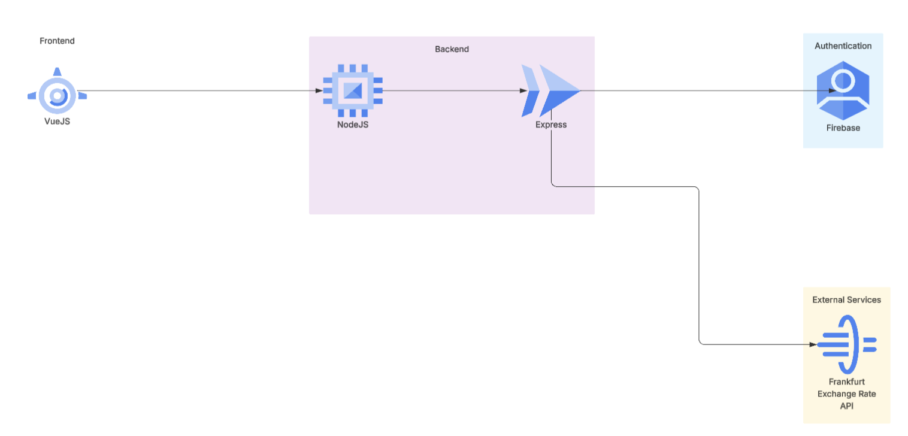
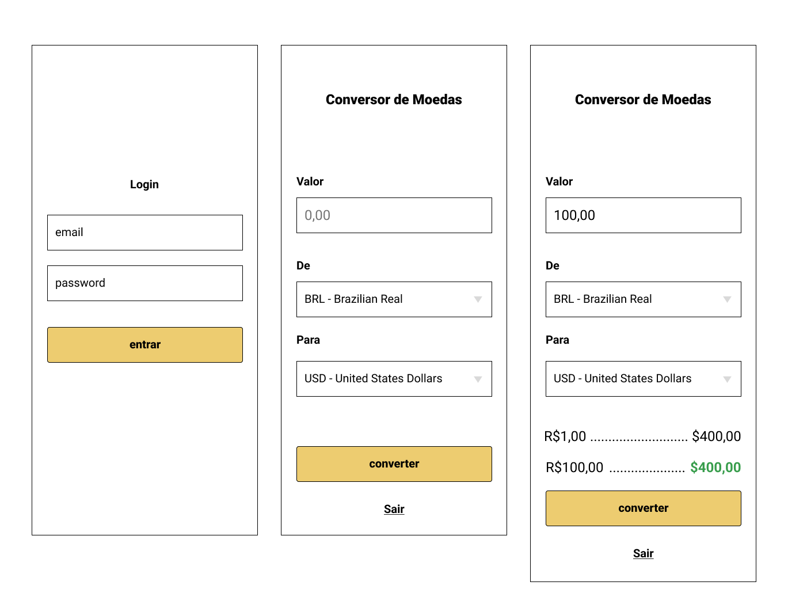

# Conversor de Moedas

Este projeto é um sistema de autenticação e conversão de moedas, com backend em **Express.js** integrado ao **Firebase** para autenticação e ao serviço **Frankfurter API** para taxas de câmbio. O frontend foi feito em **Vue 3**.

---

## Descrição

O usuário cria uma conta ou faz login usando email e senha. Depois de autenticado, ele pode acessar o conversor de moedas.  
O conversor consulta a lista de moedas disponíveis na API Frankfurter e permite calcular valores convertidos em tempo real.

A autenticação é obrigatória para acessar as rotas de câmbio.

---

## Fluxo

---

## Backend

### Rotas principais

- **POST /signup**  
  Cria um usuário no Firebase Auth.  
  Retorna `idToken` e `refreshToken`.

- **POST /login**  
  Login via Firebase Auth REST.  
  Retorna `idToken`, `refreshToken` e `expiresIn`.

- **GET /getCurrencyInfo** (protegida)  
  Retorna lista de moedas da Frankfurter API.

- **GET /converterMoeda?valor=100&de=BRL&para=USD** (protegida)  
  Converte valores entre moedas usando Frankfurter.

- **GET /health**  
  Endpoint simples para verificar se o backend está ativo.

### Middleware

- **requireAuth**  
  Valida o token JWT do Firebase enviado no header `Authorization: Bearer <token>`.

---

## Frontend (Vue 3)

- Página de **login** com armazenamento de `idToken` no `localStorage`.  
- Página de **signup** para criar conta.  
- Página de **conversão** que acessa rotas protegidas com o token no header.

---

## Integrações externas

- **Firebase Authentication**  
  Usado para criar usuários, login e validação de tokens.  
  Combina o Admin SDK e a API REST do Identity Toolkit.

- **Frankfurter API**  
  Usada para listar moedas e calcular taxas de câmbio.

---

## Armazenamento

- **LocalStorage** no frontend para guardar:  
  - `idToken`  
  - `refreshToken`  
  - `expiresIn`

- **Firebase** gerencia os usuários (sem banco próprio no backend).

---

## Testes

Os testes foram escritos com **Jest** e **Supertest**.

### O que é testado:

- **/signup**  
  - Criação de usuário com email e senha válidos.  
  - Erro quando os campos obrigatórios não são enviados.

- **/login**  
  - Login válido retorna `idToken`.  
  - Erro com credenciais inválidas.

- **/getCurrencyInfo**  
  - Falha se não tiver token.  
  - Sucesso quando token válido é enviado (mock da Frankfurter API).

- **/converterMoeda**  
  - Falha se parâmetros estão faltando.  
  - Retorna valor convertido quando a chamada é válida.  
  - Bloqueia acesso sem autenticação.

Cada teste cobre cenários positivos e negativos para garantir que o sistema funcione corretamente e que erros sejam tratados.

---

## Design inicial

